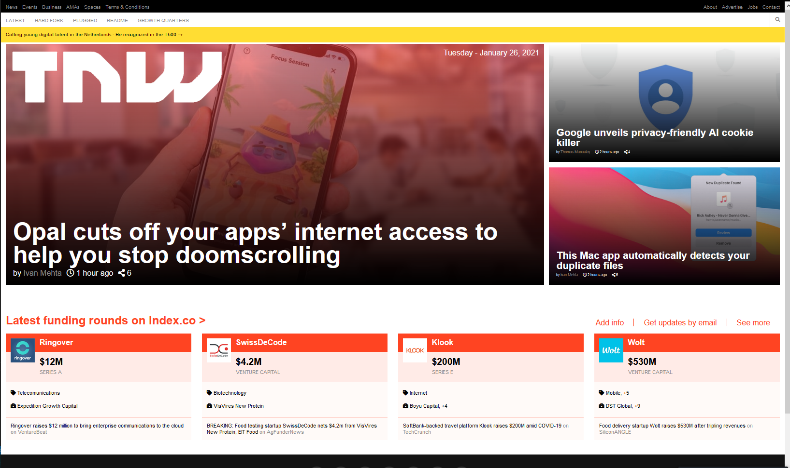

# Project-2-The-Next-Web

> Project 2: Building with Responsive Design
The goal of the project is to build a clone of The Next Web website with responsive design techniques

Project requirements included using semantic HTML, CSS and Media Queries with 2 break points, and usage of flex-box layot for Header and Footer elements.

## Built With

- HTML5
- CSS3
- CSS3 Media Queries

## Live Demo

[Live Demo Link](https://zeenatlawal.github.io/Project-2-The-Next-Web/)

## Authors

👤 **Zeenat Lawal**

- GitHub: [@ZeenatLawal](https://github.com/ZeenatLawal)
- Twitter: [@lawal_zeenat](https://twitter.com/lawal_zeenat)
- LinkedIn: [Zeenat Lawal](https://www.linkedin.com/in/zeenat-lawal-665872120/)

👤 **Aleksandar Ivezic**

- GitHub: [@AleksandarIvezic](https://github.com/ShinobiWarior)
- Twitter: [@AIvezic](https://twitter.com/AIvezic)
- LinkedIn: [Aleksandar Ivezic](https://www.linkedin.com/in/aleksandar-ivezi%C4%87-1a6b0391/)

## 🤝 Contributing

Contributions, issues, and feature requests are welcome!

Feel free to check the [issues page](https://github.com/ZeenatLawal/Project-2-The-Next-Web/issues/3).

## Show your support

Give a ⭐️ if you like this project!